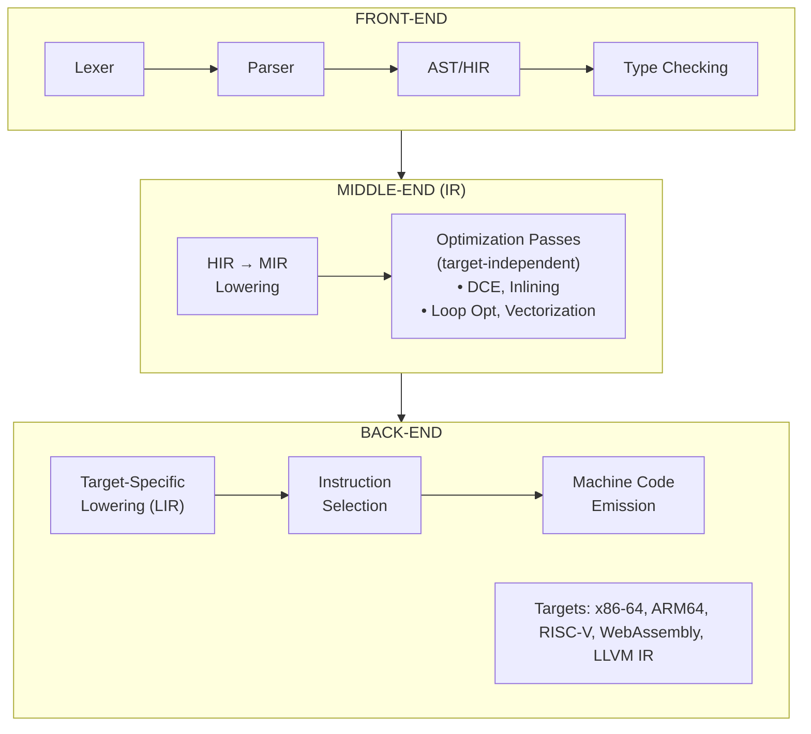
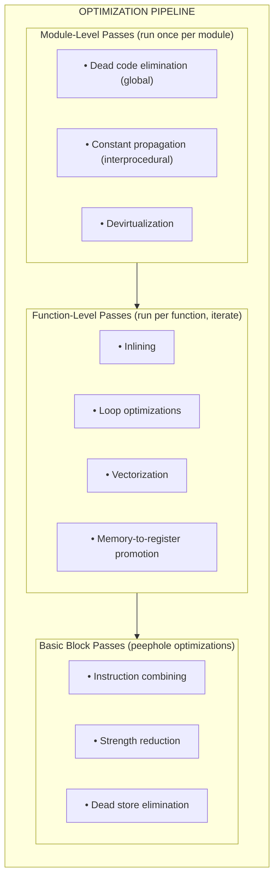
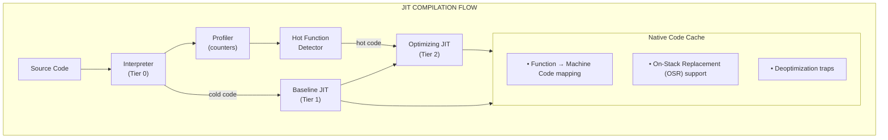
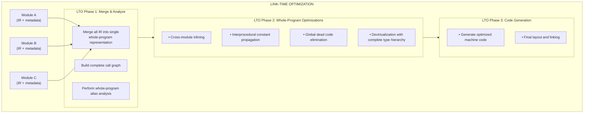
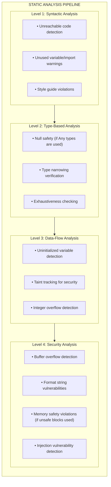

# tomi.u Compiler Architecture

**Version:** 1.0 (Design Specification)  
**Last Updated:** 2026-03-14  
**Status:** Design Phase

---

## Table of Contents

1. [Overview](#overview)
2. [Compilation Unit: Album](#compilation-unit-album)
3. [Modular Architecture](#modular-architecture)
4. [Intermediate Representation (IR)](#intermediate-representation-ir)
5. [Advanced Optimization Passes](#advanced-optimization-passes)
6. [Just-In-Time (JIT) Compilation](#just-in-time-jit-compilation)
7. [Incremental & Lazy Compilation](#incremental--lazy-compilation)
8. [Link-Time Optimization (LTO)](#link-time-optimization-lto)
9. [Profile-Guided Optimization (PGO)](#profile-guided-optimization-pgo)
10. [Static Analysis & Security Checks](#static-analysis--security-checks)
11. [Error Diagnostics](#error-diagnostics)
12. [Implementation Roadmap](#implementation-roadmap)
13. [References](#references)

---

## Overview

The tomi.u compiler is designed as a modern, multi-pass, optimizing compiler that combines the best practices from established compiler infrastructure (LLVM, GCC, Rust's rustc) with innovations tailored to the tomi.u language's unique features.

### Implementation Language

The tomi.u compiler will be implemented in **Rust**. This choice provides:

- **Memory Safety**: Rust's ownership model eliminates entire classes of bugs (null pointers, buffer overflows, data races) without runtime overhead
- **Performance**: Zero-cost abstractions and no garbage collector make Rust ideal for compiler infrastructure where performance is critical
- **Ecosystem**: Excellent parsing libraries (logos, nom, lalrpop), LLVM bindings (inkwell, llvm-sys), and mature tooling (cargo, clippy, rustfmt)
- **Pattern Matching**: Rust's exhaustive pattern matching is ideal for working with ASTs and IRs
- **Concurrency**: Fearless concurrency enables parallel compilation passes
- **Self-Hosting Pathway**: Lessons from rustc's architecture can be directly applied

### Design Priorities

The architecture prioritizes:

- **Performance**: Multiple optimization levels from fast debug builds to highly optimized release builds
- **Developer Experience**: Fast incremental compilation, excellent error messages, and seamless tooling integration
- **Safety**: Built-in static analysis and security vulnerability detection
- **Flexibility**: Support for AOT compilation, JIT compilation, and interpreted execution via Python bridge

---

## Compilation Unit: Album

The primary compilation unit in tomi.u is the **album** — analogous to a Rust *crate* or a Java *package*. An album is a tree of source files (`.tomi`) that the compiler processes as a single logical unit, producing one output artifact.

### Album Types

| Album Type | CLI flag | Description | Requirement |
|------------|----------|-------------|-------------|
| `bin` | `--album-type bin` | Executable binary album (default) | Must have a `@entrypoint def main()` |
| `lib` | `--album-type lib` | Library album, importable by other albums | No entrypoint required |

### Album Manifest (`Album.toml`)

Each album is described by a manifest file at its root:

```toml
[album]
name    = "my_app"
version = "0.1.0"
type    = "bin"
edition = "2024"

[dependencies]
standard = "1.0"
```

### Compiling an Album

```sh
# Compile a binary album (default)
tomc --album-type bin src/main.tomi

# Compile a library album
tomc --album-type lib src/lib.tomi

# Inspect album metadata
tomc src/main.tomi --emit metadata
```

### Album vs. Module

| Concept | Scope | Maps to |
|---------|---------|---------|
| **Album** | Compilation unit (one binary or library) | Rust crate, Java JAR |
| **Module** | Namespace within an album (`import a.b.c`) | Rust module, Python package |

Albums are the unit of versioning, distribution, and dependency resolution in the tomi.u ecosystem.

---

## Modular Architecture

### Front-End / Back-End Separation

The tomi.u compiler follows the classic three-phase design pioneered by LLVM and GCC, enabling clean separation between language-specific and target-specific concerns:



### Design Rationale

Following LLVM's proven architecture, this separation provides:

1. **Language Independence**: The middle-end and back-end can be reused for other languages
2. **Target Independence**: Front-end and middle-end optimizations apply to all platforms
3. **Modularity**: Each phase can be developed, tested, and profiled independently
4. **Shared Optimization Passes**: All targets benefit from the same optimization infrastructure

### Intermediate Representations

The compiler uses a cascade of IRs, each optimized for specific tasks:

| IR Level | Name | Purpose | Key Properties |
|----------|------|---------|----------------|
| **HIR** | High-Level IR | Desugared AST, still close to source | Type annotations, source spans, semantic info |
| **MIR** | Mid-Level IR | Control-flow graphs, explicit moves | SSA form, ownership/borrow analysis |
| **LIR** | Low-Level IR | Near-machine representation | Register allocation, instruction selection |

---

## Intermediate Representation (IR)

### Core IR Design Principles

The tomi.u IR serves as the central hub for all optimizations, providing a platform-agnostic representation that captures program semantics while enabling aggressive transformations.

```rust
// Example: tomi.u MIR representation (conceptual)
module example

def fibonacci(n: Int64) -> Int64:
    // MIR blocks
    bb0:
        _1 = copy n
        _2 = const 2_i64
        _3 = Lt(_1, _2)
        switchInt(_3) -> [0: bb1, otherwise: bb2]
    
    bb1:
        _4 = sub(n, const 1_i64)
        _5 = call fibonacci(_4)
        _6 = sub(n, const 2_i64)
        _7 = call fibonacci(_6)
        _8 = add(_5, _7)
        return _8
    
    bb2:
        return copy n
```

### Static Single Assignment (SSA) Form

The MIR uses SSA form where each variable is assigned exactly once, enabling efficient data-flow analysis:

**Benefits of SSA:**
- Simplified dead code elimination
- Efficient constant propagation
- Easier alias analysis
- Natural representation for phi-nodes at control flow joins

### Type Information Preservation

Unlike LLVM IR, the tomi.u IR retains high-level type information throughout the pipeline:

```
HIR Types → Generic types, traits, lifetimes (conceptual borrowing)
MIR Types → Monomorphized types, layout information
LIR Types → Machine types with ABI details
```

---

## Advanced Optimization Passes

### Optimization Pipeline Overview



### Inlining & Dead Code Elimination

**Inlining Strategy:**

The inliner uses a cost-benefit model considering:

- Function size (instruction count)
- Call site frequency (from profiling or heuristics)
- Arguments that become constants after inlining
- Recursion depth limits
- Whether the function is hot (from PGO data)

```
Inline if: benefit(call_site) > cost(code_size_increase) × threshold

Where:
  benefit = estimated_cycles_saved × call_frequency
  cost = instruction_count × (1 + spill_pressure_estimate)
```

**Dead Code Elimination (DCE):**

Multi-level DCE operates at:

1. **Trivial DCE**: Remove instructions with no side effects whose results are unused
2. **Aggressive DCE**: Remove code unreachable from entry points
3. **Global DCE**: Remove entire functions, structs, and constants that are never used

```rust
// Before DCE
def compute():
    let x = expensive_calc()
    let y = another_calc()
    return y  // x is never used

// After DCE
def compute():
    let y = another_calc()
    return y
```

### Loop Optimizations

The loop optimization pipeline handles complex transformations:

#### Loop-Invariant Code Motion (LICM)

Hoists computations that don't change across iterations:

```rust
// Before LICM
for i in 0..n:
    let factor = compute_factor()  // Same every iteration
    result[i] = data[i] * factor

// After LICM
let factor = compute_factor()
for i in 0..n:
    result[i] = data[i] * factor
```

#### Loop Unrolling

```rust
// Before (tight loop)
for i in 0..4:
    sum += arr[i]

// After unrolling (eliminates loop overhead)
sum += arr[0]
sum += arr[1]
sum += arr[2]
sum += arr[3]
```

#### Loop Vectorization

Automatically converts scalar loops to SIMD operations:

```rust
// Original scalar code
for i in 0..len:
    c[i] = a[i] + b[i]

// Vectorized (conceptual AVX-512)
for i in 0..len step 8:
    c[i..i+8] = vec_add(a[i..i+8], b[i..i+8])
```

#### Loop Interchange

Optimizes memory access patterns for cache efficiency:

```rust
// Before: Poor spatial locality (row-major array, column access)
for j in 0..cols:
    for i in 0..rows:
        matrix[i][j] = matrix[i][j] * 2

// After: Improved cache utilization
for i in 0..rows:
    for j in 0..cols:
        matrix[i][j] = matrix[i][j] * 2
```

#### Loop Fusion

Combines adjacent loops to reduce overhead and improve cache utilization:

```rust
// Before: Two separate loops
for i in 0..n:
    a[i] = b[i] * 2
for i in 0..n:
    c[i] = a[i] + 1

// After fusion: Single pass
for i in 0..n:
    a[i] = b[i] * 2
    c[i] = a[i] + 1
```

### Automatic Vectorization & Parallelization

#### SIMD Vectorization

The compiler automatically targets SIMD instruction sets:

| Target | SIMD Support |
|--------|--------------|
| x86-64 | SSE4.2, AVX, AVX2, AVX-512 |
| ARM64 | NEON, SVE, SVE2 |
| WebAssembly | SIMD128 |
| RISC-V | V extension |

**Vectorization Process:**

1. **Loop Analysis**: Identify vectorizable loops (no loop-carried dependencies)
2. **Cost Model**: Estimate benefit vs. scalar version
3. **Legality Check**: Verify memory alignment, no aliasing
4. **Code Generation**: Emit vector intrinsics or let backend handle

```rust
// Compiler hint for explicit vectorization
@simd
def dot_product(a: &[Float32], b: &[Float32]) -> Float32:
    var sum: Float32 = 0.0
    for i in 0..a.len():
        sum += a[i] * b[i]
    return sum
```

#### Automatic Parallelization

For marked regions, the compiler can generate parallel code:

```rust
// Explicit parallel iteration
@parallel
for chunk in data.chunks(1024):
    process(chunk)

// Compiler generates:
// - Work splitting logic
// - Thread pool task submission
// - Result aggregation
```

---

## Just-In-Time (JIT) Compilation

### JIT Architecture

The tomi.u JIT compiler enables runtime code generation for:

- **REPL environment**: Immediate code execution during development
- **Hot code optimization**: Recompilation based on runtime profiling
- **Dynamic dispatch optimization**: Devirtualization based on observed types



### Tiered Compilation

| Tier | Description | When Used | Optimization Level |
|------|-------------|-----------|-------------------|
| **0** | Interpreter / Bytecode | First execution | None |
| **1** | Baseline JIT | After ~10 executions | Minimal (fast compile) |
| **2** | Optimizing JIT | After ~10,000 executions | Full optimization |

### On-Stack Replacement (OSR)

Allows upgrading running code without stopping execution:

```rust
def long_running_loop():
    for i in 0..1_000_000:
        // After threshold, OSR kicks in:
        // 1. Capture current loop state (i, locals)
        // 2. Compile optimized version
        // 3. Transfer execution to optimized code
        do_work(i)
```

### Deoptimization

When assumptions made during JIT compilation are invalidated:

```rust
// JIT assumed `obj` is always type `Foo`
def process(obj: Any):
    obj.method()  // Inlined Foo.method

// If called with type `Bar`, deoptimize:
// 1. Trap on type check failure
// 2. Fall back to interpreter
// 3. Recompile without assumption
```

---

## Incremental & Lazy Compilation

### Incremental Compilation Architecture

```mermaid
flowchart TB
    subgraph Incremental["INCREMENTAL COMPILATION"]
        Source["Source Files\n(changed)"] --> DepGraph
        
        subgraph DepGraph["Dependency Graph Analysis"]
            D1["• Track: which functions depend on which types"]
            D2["• Track: which modules import which symbols"]
            D3["• Track: macro expansion dependencies"]
        end
        
        DepGraph --> Invalidation
        
        subgraph Invalidation["Invalidation Set Computation"]
            I1["• Modified file → affected compilation units"]
            I2["• Transitive closure of dependencies"]
        end
        
        Invalidation --> Recompile
        
        subgraph Recompile["Selective Recompilation"]
            R1["• Recompile only invalidated units"]
            R2["• Reuse cached results for unchanged units"]
            R3["• Incremental linking"]
        end
    end
```



### Query-Based Compilation (Inspired by Rust's rustc)

The compiler uses a demand-driven query system:

```rust
// Conceptual query system
query type_of(def_id: DefId) -> Type:
    // Result is memoized
    // Dependencies are tracked
    // Invalidation propagates automatically

query mir_of(def_id: DefId) -> MIR:
    depends_on(type_of(def_id))
    // ...
```

### Compilation Caching Levels

| Cache Level | Contents | Persisted? |
|-------------|----------|------------|
| **L1** | Parsed AST | Session only |
| **L2** | Type-checked HIR | Session only |
| **L3** | Optimized MIR | Disk (incremental cache) |
| **L4** | Object code | Disk (build artifacts) |

### Lazy Compilation

For development builds, the compiler defers code generation:

```rust
// Only the entrypoint path is compiled eagerly
@entrypoint
def main():
    if debug_mode:
        debug_function()  // Compiled on first call
    else:
        release_function()  // May never be compiled in debug run
```

---

## Link-Time Optimization (LTO)

### LTO Architecture



### LTO Modes

| Mode | Description | Build Time | Optimization |
|------|-------------|------------|--------------|
| **Thin LTO** | Parallel, summary-based | Fast | Good |
| **Fat LTO** | Whole-program, single-threaded | Slow | Best |
| **Incremental LTO** | Reuse previous LTO results | Medium | Good |

### Cross-Module Optimizations Enabled by LTO

1. **Cross-Module Inlining**
   ```rust
   // module_a.tu
   pub def helper(x: Int32) -> Int32:
       return x * 2
   
   // module_b.tu
   import module_a.helper
   
   def compute(x: Int32) -> Int32:
       return helper(x) + 1  // Inlined at link time
   ```

2. **Interprocedural Constant Propagation**
   ```rust
   // Constants flow across modules
   pub const MULTIPLIER: Int32 = 10
   
   // In another module: `x * MULTIPLIER` becomes `x * 10`
   ```

3. **Dead Code Elimination Across Modules**
   ```rust
   // Unused public functions can be removed
   pub def unused():  // Eliminated if no callers found
       pass
   ```

---

## Profile-Guided Optimization (PGO)

### PGO Workflow

```mermaid
flowchart TB
    subgraph PGO["PROFILE-GUIDED OPTIMIZATION"]
        subgraph Step1["Step 1: Instrumented Build"]
            Cmd1["$ tomic build --pgo=generate"]
            S1A["Inserts profiling counters for:"]
            S1B["• Basic block execution counts"]
            S1C["• Branch taken/not-taken frequencies"]
            S1D["• Indirect call target distributions"]
            S1E["• Value profiling for size parameters"]
        end
        
        Step1 --> Step2
        
        subgraph Step2["Step 2: Profile Collection"]
            Cmd2["$ ./instrumented_binary < representative_workload"]
            S2A["Generates: profile.profdata"]
            S2B["• Real-world execution patterns"]
            S2C["• Hot path identification"]
            S2D["• Branch probability data"]
        end
        
        Step2 --> Step3
        
        subgraph Step3["Step 3: Optimized Build"]
            Cmd3["$ tomic build --pgo=use --profile=profile.profdata"]
            S3A["Uses profile data for:"]
            S3B["• Inlining decisions (inline hot functions)"]
            S3C["• Basic block layout (hot paths straight-line)"]
            S3D["• Register allocation (prioritize hot variables)"]
            S3E["• Loop optimizations (unroll frequently-executed loops)"]
        end
    end
```



### Profile Data Types

| Data Type | What It Captures | Optimization Enabled |
|-----------|------------------|---------------------|
| **Edge Counts** | Branch frequencies | Code layout, branch prediction hints |
| **Block Counts** | Execution frequency | Hot/cold partitioning |
| **Value Profiles** | Common argument values | Specialization, switch optimization |
| **Indirect Targets** | Call target distribution | Devirtualization, inline caching |
| **Memory Access** | Access patterns | Prefetching hints |

### PGO Optimizations

1. **Hot/Cold Code Splitting**
   ```
   Hot code:  Kept together for cache efficiency
   Cold code: Moved to separate sections, potentially paged out
   ```

2. **Branch Layout Optimization**
   ```rust
   // Profile shows `condition` is true 95% of time
   if condition:
       // Hot path: placed inline
       hot_code()
   else:
       // Cold path: placed in __cold section
       cold_code()
   ```

3. **Indirect Call Promotion**
   ```rust
   // Profile shows 80% of calls go to `ConcreteType.method`
   def call_virtual(obj: &dyn Trait):
       // Generated code:
       if obj.vtable == ConcreteType.vtable:
           ConcreteType.method(obj)  // Direct call
       else:
           obj.method()  // Fallback virtual call
   ```

---

## Static Analysis & Security Checks

### Analysis Pipeline



### Security Vulnerability Detection

#### Buffer Overflow Prevention

```rust
// Static analysis detects potential overflow
def vulnerable(data: &[UInt8]):
    var buffer: [UInt8; 100]
    for i in 0..data.len():
        buffer[i] = data[i]  // ERROR: data.len() may exceed 100
```

**Detection Mechanisms:**

1. **Bounds Checking**: All array accesses are bounds-checked by default
2. **Size Analysis**: Track array sizes through control flow
3. **Contract Verification**: Verify preconditions at call sites

#### Taint Analysis

Track untrusted data through the program:

```rust
// Taint flows from user input
let user_input = read_stdin()  // Tainted

// Warning: tainted data used in SQL query
let query = f"SELECT * FROM users WHERE name = '{user_input}'"
execute_sql(query)  // SECURITY: SQL injection risk

// Safe alternative
execute_sql_prepared("SELECT * FROM users WHERE name = ?", [user_input])
```

#### Memory Safety Checks

When interfacing with unsafe code:

```rust
@unsafe
def raw_pointer_access():
    let ptr = allocate_raw(100)
    
    // Analysis checks:
    // ✓ ptr is not null after allocation
    // ✓ access is within allocated bounds
    // ✓ no use-after-free
    // ✓ no double-free
    
    ptr[50] = 42  // OK
    free_raw(ptr)
    ptr[0] = 1    // ERROR: Use after free detected
```

### Analysis Configuration

```toml
# tomic.toml
[analysis]
level = "strict"  # minimal, standard, strict, paranoid

[security]
detect_injection = true
detect_overflow = true
taint_tracking = true

[warnings]
unused_variables = "error"
unreachable_code = "warn"
```

---

## Error Diagnostics

### Diagnostic Design Philosophy

Inspired by Elm and Rust, tomi.u prioritizes helpful, educational error messages:

1. **Clear identification**: What exactly went wrong
2. **Precise location**: Exactly where in the code
3. **Explanation**: Why this is an error
4. **Suggestion**: How to fix it
5. **Examples**: Show correct usage when helpful

### Error Message Format

```
error[E0123]: mismatched types
  ┌─ src/main.tu:15:12
  │
15 │     let x: String = compute_number()
  │            ------   ^^^^^^^^^^^^^^^^
  │            │        │
  │            │        expected `String`, found `Int64`
  │            │
  │            expected due to this type annotation
  │
  = note: `compute_number()` returns `Int64`
  
help: consider converting the number to a string
  │
15 │     let x: String = compute_number().to_string()
  │                                      ^^^^^^^^^^^^

For more information about this error, try `tomic explain E0123`
```

### Color Coding

| Color | Meaning |
|-------|---------|
| 🔴 Red | Error location, problematic code |
| 🔵 Blue | Related code, type annotations |
| 🟢 Green | Suggested fix |
| 🟡 Yellow | Warnings |
| ⚪ Gray | Context, notes |

### Rich Error Features

1. **Multi-span errors**: Show all related locations
   ```
   error[E0456]: conflicting implementations
     ┌─ src/impl_a.tu:10:1
     │
   10 │ impl Display for MyType:
     │ ^^^^^^^^^^^^^^^^^^^^^^^^ first implementation here
     │
     ┌─ src/impl_b.tu:5:1
     │
   5  │ impl Display for MyType:
     │ ^^^^^^^^^^^^^^^^^^^^^^^^ conflicting implementation here
   ```

2. **Contextual suggestions**: Based on what was likely intended
   ```
   error[E0789]: cannot find value `lenght` in this scope
     ┌─ src/main.tu:20:15
     │
   20 │     let n = s.lenght()
     │               ^^^^^^
     │               │
     │               help: did you mean `length`?
   ```

3. **Type mismatch visualization**:
   ```
   error[E0308]: mismatched types
   
   expected: Option<Result<String, Error>>
      found: Result<Option<String>, Error>
   
   difference:
      Option< Result<String, Error> >
      Result< Option<String>, Error >
      ^^^^^^  ^^^^^^               
            swapped
   ```

### IDE Integration

The compiler outputs diagnostics in both human-readable and machine-readable formats:

```json
{
  "diagnostics": [
    {
      "severity": "error",
      "code": "E0123",
      "message": "mismatched types",
      "spans": [
        {
          "file": "src/main.tu",
          "line_start": 15,
          "line_end": 15,
          "column_start": 12,
          "column_end": 27,
          "label": "expected `String`, found `Int64`"
        }
      ],
      "suggestions": [
        {
          "message": "convert to string",
          "replacement": "compute_number().to_string()"
        }
      ]
    }
  ]
}
```

---

## Implementation Roadmap

### Phase 1: Foundation (v0.1 - v0.3)
- [x] Design IR specification
- [ ] Implement basic optimization passes
  - [ ] Dead code elimination
  - [ ] Constant folding
  - [ ] Simple inlining
- [ ] Error diagnostic system

### Phase 2: Core Optimizations (v0.4 - v0.6)
- [ ] Loop optimization framework
  - [ ] LICM
  - [ ] Loop unrolling
  - [ ] Loop vectorization (basic)
- [ ] Incremental compilation system
- [ ] Basic static analysis

### Phase 3: Advanced Features (v0.7 - v0.9)
- [ ] JIT compilation framework
- [ ] Profile-guided optimization
- [ ] Link-time optimization
- [ ] Advanced vectorization (auto-parallelization)

### Phase 4: Polish (v1.0)
- [ ] Security analysis integration
- [ ] Full IDE diagnostics support
- [ ] Performance tuning
- [ ] Documentation and examples

---

## References

### Academic Papers

1. Lattner, C., & Adve, V. (2004). *LLVM: A Compilation Framework for Lifelong Program Analysis & Transformation*. CGO '04.

2. Click, C., & Cooper, K. (1995). *Combining Analyses, Combining Optimizations*. ACM TOPLAS.

3. Poletto, M., & Sarkar, V. (1999). *Linear scan register allocation*. ACM TOPLAS.

4. Cytron, R., et al. (1991). *Efficiently Computing Static Single Assignment Form and the Control Dependence Graph*. ACM TOPLAS.

### Industry Resources

- [LLVM Documentation](https://llvm.org/docs/)
- [GCC Internals](https://gcc.gnu.org/onlinedocs/gccint/)
- [Rust Compiler Development Guide](https://rustc-dev-guide.rust-lang.org/)
- [V8 TurboFan Design](https://v8.dev/docs/turbofan)

### Compiler Textbooks

- Aho, Lam, Sethi, Ullman. *Compilers: Principles, Techniques, and Tools* (2nd ed.)
- Cooper, Torczon. *Engineering a Compiler* (2nd ed.)
- Muchnick. *Advanced Compiler Design and Implementation*

---

*This document is part of the tomi.u language specification. For implementation details, see the source code and inline documentation.*
